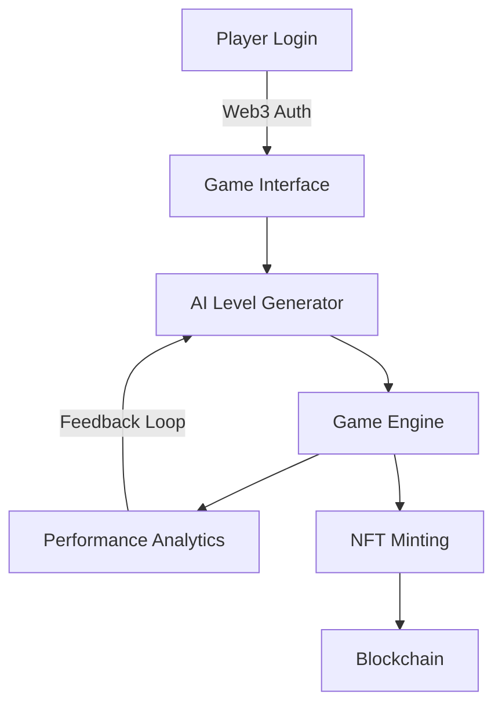

 
# 🎮 WumpusQuest.AI

> *The Ultimate AI-Generated Wumpus World Adventure with NFT Rewards for DeGens*

[Play Now](#) • [Documentation](#) • [NFT Collection](#) • [Leaderboard](#)

## 🌟 Overview

WumpusQuest.AI revolutionizes the classic Wumpus World game by combining artificial intelligence, blockchain technology, and NFT rewards. Navigate through dynamically generated mazes, battle wumpuses, and earn unique NFTs while experiencing difficulty levels that adapt to your gameplay style.

### 🎯 Game Mechanics

- **Dynamic Grid System**: Starting from 4x4, expanding to 6x6 based on player performance
- **AI-Generated Levels**: Each maze is uniquely created using advanced algorithms
- **Adaptive Difficulty**: Game evolves based on player performance metrics
- **NFT Rewards**: Earn exclusive NFTs for level completion and special achievements
- **Anti-Bot Measures**: Secure human verification system for fair gameplay

## ⚡ Core Features

### 🤖 AI Level Generation
- **Dynamic Obstacle Placement**: Based on standard Wumpus World formulas:
  - Pit Probability = `rooms / 5`
  - Wumpus Count = `Math.floor(grid_size / 4)`
  - Gold Placement = `1 per level`
- **Difficulty Scaling**: AI analyzes player performance to adjust:
  - Path complexity
  - Resource availability
  - Time constraints
  - Enemy behavior patterns

### 🎨 NFT Reward System
- **Level Completion NFTs**: Unique artwork for each conquered stage
- **Achievement NFTs**: Special tokens for extraordinary feats
- **Master Collection**: Exclusive NFT for completing all levels
- **Rarity System**: NFT attributes based on:
  - Completion time
  - Resources collected
  - Efficiency score
  - Strategy rating

### 🔒 Security Features
- **Human Verification**: Wallet-based authentication
- **Anti-Bot Measures**: 
  - Captcha integration
  - Behavioral analysis
  - Pattern detection
  - Time-based challenges

## 🏗️ Technical Architecture

## 💻 Technology Stack

### Game Core
- **Frontend**: React.js with Next.js
- **Backend**: Node.js + Express
- **Database**: MongoDB
- **AI Engine**: TensorFlow.js
- **Smart Contracts**: Solidity

### Web3 Integration
- **Blockchain**: Ethereum/Polygon
- **NFT Standard**: ERC-721
- **Wallet Connect**: MetaMask/WalletConnect
- **IPFS**: NFT Metadata Storage

## 🎮 Gameplay Elements

### Player Abilities
- **Sensing**: Detect nearby dangers
- **Navigation**: Strategic movement
- **Resource Management**: Limited arrows
- **Special Actions**: Grab gold, shoot wumpus

### Scoring System
- **Base Points**: Gold collection
- **Time Bonus**: Speed completion
- **Efficiency**: Resource usage
- **Strategy**: Path optimization

## 🛣️ Development Roadmap

### Phase 1: Foundation (Q2 2024)
- [ ] Core game mechanics
- [ ] Basic AI implementation
- [ ] Web3 wallet integration

### Phase 2: Enhancement (Q3 2024)
- [ ] Advanced AI algorithms
- [ ] NFT reward system
- [ ] Leaderboard implementation

### Phase 3: Expansion (Q4 2024)
- [ ] Mobile responsiveness
- [ ] Multiplayer modes
- [ ] Tournament system

## 🎨 NFT Collections

### Level NFTs
- **Common**: 4x4 grid completion
- **Rare**: 5x5 grid mastery
- **Epic**: 6x6 grid conquest
- **Legendary**: Perfect completion

### Achievement NFTs
- **Speedrunner**: Quick completion times
- **Strategist**: Optimal path finding
- **Resource Master**: Perfect resource management
- **Legend**: Complete all challenges

## 🤝 For DeGens, By DeGens

- **Community Governance**: DAO implementation planned
- **Token Utility**: Future gameplay benefits
- **Trading System**: NFT marketplace integration
- **Staking Rewards**: Coming in Phase 3

## 🔒 Security Measures

- **Smart Contract Audits**: Regular security checks
- **Anti-Cheat System**: Advanced detection methods
- **Secure Minting**: Rate-limited NFT creation
- **Player Protection**: Encrypted game state

## 📊 Future Expansions

- **Custom Level Creator**: Community-made challenges
- **Tournament Mode**: Competitive gameplay
- **Cross-Chain Support**: Multiple blockchain integration
- **Mobile App**: Native mobile experience

## 📞 Community & Support

- 📧 Email: support@wumpusquest.ai
- 💬 Discord: [Join our community](#)
- 🐦 Twitter: [@WumpusQuestAI](#)
- 📱 Telegram: [WumpusQuest Official](#)

## 📄 License

This project is licensed under the MIT License - see the [LICENSE](LICENSE) file for details.

---

**Built with 🎮 by the WumpusQuest Team**

[⬆ Back to Top](#-wumpusquestai)

